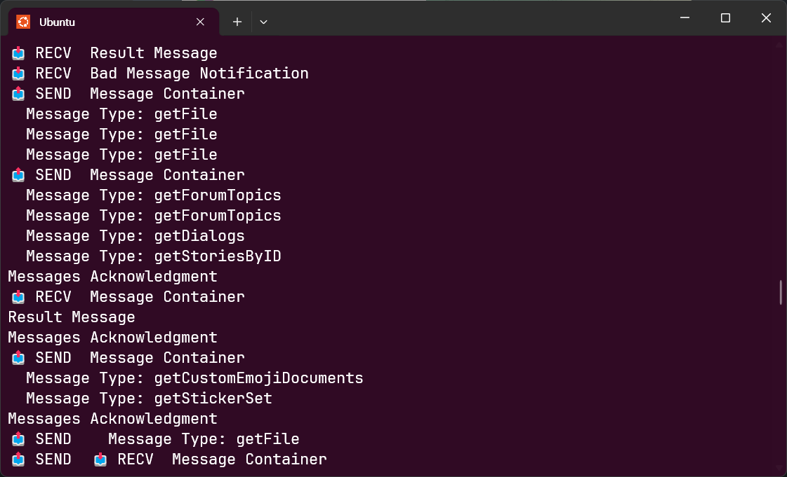

# Tele-Tapper

A Forensic Tool for Telegram protocol analysis and Telegram MTProto Tapper

Inspired by [kvakirsanov/docker-telegram-desktop-frida-mtproto-logger](https://github.com/kvakirsanov/docker-telegram-desktop-frida-mtproto-logger)


## Description

Telegram uses AES-IGE encryption to transmit MTProto messages. Using Frida, the AES encryption and decryption processes are hooked, and the MTProto protocol data is extracted/output.

## Requirements

- Telegram 6.4.1 For linux
- Frida core devkit(https://github.com/frida/frida/releases/)

## Quick Start

```bash
# Just run hook/main.go
go run cmd/hook
```
